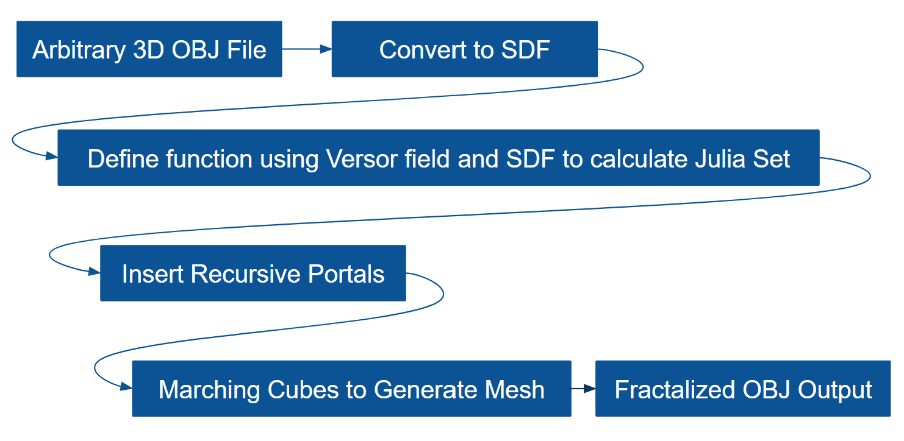
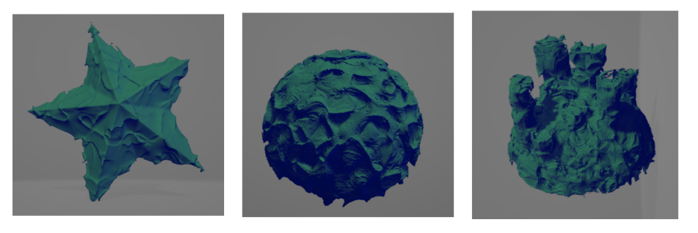
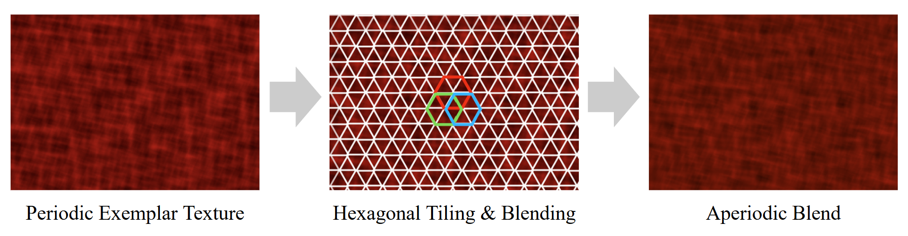

# Ocean Rendering
Joanna Fisch, Nick Liu, Yuhan Liu

Real-time, infinitely explorable ocean, generated by combining some of the latest publications in parallelizable graphics algorithms. 
Implemented in WebGPU. 

[Live Demo](https://yuhanliu-tech.github.io/under_the_sea/)

## Table of Contents

* 🪸 Coral Reefs: Generation & Placement
* 🌅 Ocean Surface: Tiling & Blending
* 🌊 Underwater Spectral Rendering: Multi and Single Scattering
* 🪼 Additional Features

## 🪸 Coral Reefs: Generation & placement

### Fractalized Mesh Generation

Implementation of 2024 SIGGRAPH paper [Into the portal: Directable Fractal Self-Similarity](https://dl.acm.org/doi/10.1145/3641519.3657466) by Alexa Schor and Theodore Kim

 

### Coral Reef Instanced Rendering

 

## 🌅 Ocean Surface: Tiling & Blending

 

### Surface Compute Shader 

## 🌊 Underwater Spectral Rendering: Scattering

### Ocean Data-Informed Multiple Scattering

### Lighting Effects via Single Scattering

## 🪼 Additional Features 

### Raymarched Jellyfish

## Sources

Base Code: 

OBJ Loading: 

