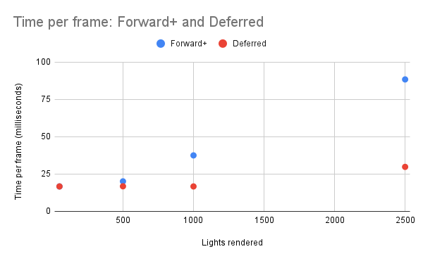
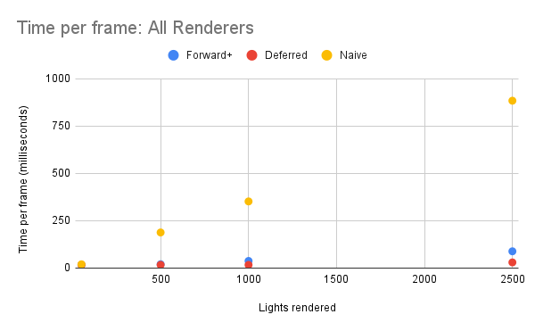

WebGL Forward+ and Clustered Deferred Shading
======================

**University of Pennsylvania, CIS 565: GPU Programming and Architecture, Project 4**

* Nicholas Liu
* Tested on: (TODO) **Google Chrome 222.2** on
  Windows 22, i7-2222 @ 2.22GHz 22GB, GTX 222 222MB (Moore 2222 Lab)

### Live Demo
https://liunicholas6.github.io/Project4-WebGPU-Forward-Plus-and-Clustered-Deferred/

### Features
Three different renderers are implemented.

The first renderer is the naive renderer. In the naive renderer, light calculations are performed for each light, for each pixel of geometry. This is the most straightforward manner of renderering, and serves as a baseline for  performance. Computing lighting in this manner is a very expensive process that has a lot of wasted work.

The second renderer is the forward+ clustered renderer. In a forward+ renderer, we address one cause of wasted work: each fragment sums up lighting contributions from every light in the scene, even if said light is far away from the fragment and contributes zero or near zero irradiance to the fragment. In the forward+ renderer, the scene is separated into view-space frustum shaped clusters. In a compute shader, each cluster tracks which lights bounding spheres intersect with it. Then in the main lighting pass, a fragment only accumulates irradiance from its containing cluster -- thus not expending computation on many of the lights that do not affect it.

The third renderer is the deferred renderer. The deferred renderer addresses the other major cause of wasted work: performing lighting calculations on fragments that are never viewed. A deferred renderer works in 2 passes. The first pass creates a g-buffer: a collection of textures holding relevant rendering information, including depth, normals, and material properties (just albedo for this renderer). Then, in the second pass, lighting calculations are performed on a full screen quadrangle that reads from the g-buffer. Since fragments that are occluded by other geometry do not have their information in the g-buffer, lighting calculations are only performed once per pixel of the output render texture.

### Performance analysis
I used a simple timer to track the average time per frame for each renderer. Measurements were taken after 1000 frames each.

We would expect the naive renderer to perform better for a small number of lights, as there isn't the overhead of performing a light clustering pass or performing 2 passes, but I did not observe this in practice as at such a small light count the time per frame is capped at 16.7 ms/frame -- the inverse refresh rate of my monitor.

As we would expect, the time for frame for deferred renderer is generally better than forward+, and continues to get better as the number of lights in the scene increases.

Unsurprisingly, the naive renderer performs very poorly in comparison, and renders my computer basically unusable at around 1000 lights.

### Credits

- [Vite](https://vitejs.dev/)
- [loaders.gl](https://loaders.gl/)
- [dat.GUI](https://github.com/dataarts/dat.gui)
- [stats.js](https://github.com/mrdoob/stats.js)
- [wgpu-matrix](https://github.com/greggman/wgpu-matrix)
