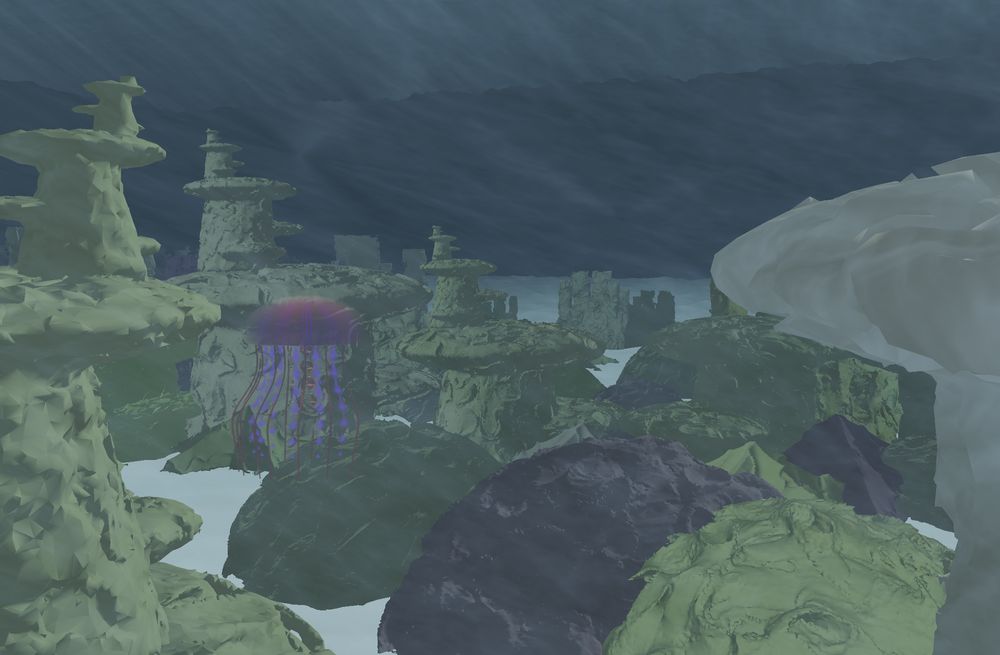
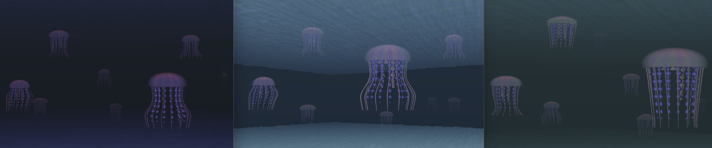

# Spectral Sea: Real-Time Ocean Rendering
Joanna Fisch, Nick Liu, Yuhan Liu

Real-time, infinitely explorable ocean, generated by combining some of the latest publications in parallelizable graphics algorithms. 
Implemented in WebGPU. 

[CLICK ME: Live Demo](https://yuhanliu-tech.github.io/spectral-sea/) (⚠️May take a minute to load!)

 

## Table of Contents
* 🌅 Ocean Surface: Tiling & Blending
* 🌊 Underwater Spectral Rendering: Multiple Scattering
* 🔦 Lighting Effects via Single Scattering
* 🪸 Coral Reefs: Generation & Placement
* 🪼 Additional Features

## 🌅 Ocean Surface: Tiling & Blending

Implementation of 2024 High Performance Graphics paper [Fast Orientable Aperiodic Ocean Synthesis Using Tiling & Blending](http://arnaud-schoentgen.com/publication/2024_orientable_ocean/2024_orientable_ocean.pdf)

We implemented the above paper's technique for creating a fast and believable ocean surface by combining tiling and blending methods with a foundational sinusoidal ocean texture. 

 

We begin with a simple, periodic sinusoidal texture, called our "exemplar texture", created by overlapping sine waves to create a simple ocean (left image). The core idea is to efficiently synthesize a realistic ocean by overlapping multiple texture tiles, specifically utilizing three regular hexagonal tilings (middle image). In this method, each texel (texture pixel) is influenced by multiple tiles, with blending weights peaking at the center of each tile and diminishing towards the edges. This approach preserves the spatial mean and variance of the exemplar texture, resulting in a seamless and non-repetitive ocean surface (right image).

This technique is implemented in a WebGPU compute shader, resulting in an ocean texture that preserves the physical characteristics of waves while concealing artificial-looking periodicity. Below is a GIF showing our results. 

 

## 🌊 Underwater Spectral Rendering: Scattering

### Ocean Data-Informed Multiple Scattering
We implement the constant-time multiscattering estimation (assuming a near-constant elevation for the ocean surface and floor in the area about a particular fragment) from [Real-time Underwater Spectral Rendering](https://onlinelibrary.wiley.com/doi/epdf/10.1111/cgf.15009).

Data is taken from [an open source paper](https://figshare.com/articles/dataset/Dataset_to_accompany_paper_Depth_profiles_of_Jerlov_water_types/21710252) for 3 different Jerlov water types, each of which classifies a set of different ocean water properties.

Below are a handful of results from different ocean properties, which can be observed in different water hues and turbidity:

## 🔦 Lighting Effects via Single Scattering

### Caustics

We utilize a [procedural caustics texture](https://www.shadertoy.com/view/MdlXz8) to generate fairly performant, tileable caustics on the ocean floor. We consider the inscattering from a particular point in the scene to be the radiance directly transmitted from the surface, where the incoming irradinace is some uniform sun strength along with radiance from the procedural texture. Doing so creates the effect of god rays throughout the scene.

## 🪸 Coral Reefs: Generation & placement

### Fractalized Mesh Generation

Implementation of 2024 SIGGRAPH paper [Into the portal: Directable Fractal Self-Similarity](https://dl.acm.org/doi/10.1145/3641519.3657466) by Alexa Schor and Theodore Kim

 

We utilize Schor and Kim's technique for fractalizing meshes, which involves using Julia-set-inspired dynamical system to generate specifiable self-similar regions with chaotic details. The workflow, described in the image above, includes taking an arbitrary input OBJ which is then converted into an SDF.

By defining a function to be the SDF times some versor function (i.e. 3d perlin noise), applied to some point multiple times, and taking the level set of the output, we are able to generate geometry that has a fine-grained fractal texture.

Furthermore, by using "portals," i.e regions where we evaluate the SDF at some transformation of a target region rather than SDF * versor function, which we use to introduce self-similarity in our corals.

We use this technique for generating fractalized coral assets, and examples of resulting meshes are pictured below.

 *Various fractalized coral types*

 *An example of "table coral", generated using fractalized geometry with portals, that we use in our demo.*

### Coral Reef Instanced Rendering

We combined procedural generation with GPU-accelerated instancing to efficiently render a large number of coral instances across an ocean floor terrain.

To ensure an even distribution, a grid spacing technique is used for global placement. Corals are initially placed in a uniform grid, with each cell receiving one coral instance. This systematic approach ensures complete coverage of the terrain while maintaining consistent spacing between corals.

For added realism, a Perlin noise function is applied to each coral's position within its grid cell. This introduces subtle offsets in both the x and z coordinates, breaking up the rigid grid-like appearance and creating a more natural and organic distribution. The y-coordinate (height) of each coral is adjusted based on the terrain's displacement map, ensuring that corals are correctly placed on the undulating ocean floor. The ocean floor terrain is generated using a displacement map similar to the ocean surface to simulate a realistic underwater landscape.

The computed positions, along with other instance-specific attributes like orientation and scale, are stored in a GPU storage buffer. These attributes are then passed to the vertex shader during rendering. GPU instancing allows all corals to share a single model while being uniquely positioned and transformed, significantly reducing the overhead of rendering thousands of individual corals. This approach ensures high performance while maintaining visual complexity, allowing for the creation of large-scale, procedurally generated coral reef environments that move seamlessly with the player's perspective.

Below is an image showing instanced rendering of coral clumps. 

 

## 🪼 Additional Features 

### Raymarched Jellyfish

 

We created a fragment shader that utilizes ray marching to render jellyfish NPCs. The shader uses ray marching to traverse the underwater space, calculating distances to shapes defined by signed distance functions. Procedural noise functions drive animated effects like pulsation, creating a sense of movement. Volumetric techniques simulate translucent effects, creating the appearance of light scattering within the jellyfish, while custom lighting calculations enhance realism with reflections, refractions, and ambient light. The shader efficiently renders multiple jellyfish instances through spatial repetition functions and optimizes performance by skipping empty spaces during ray marching.

 

## Sources

Base Code: https://github.com/CIS5650-Fall-2024/Project4-WebGPU-Forward-Plus-and-Clustered-Deferred

OBJ Loading: https://carmencincotti.com/2022-06-06/load-obj-files-into-webgpu/

Jellyfish Shader: https://www.shadertoy.com/view/McGcWW

Into the Portal Code: https://github.com/alexaschor/IntoThePortal

